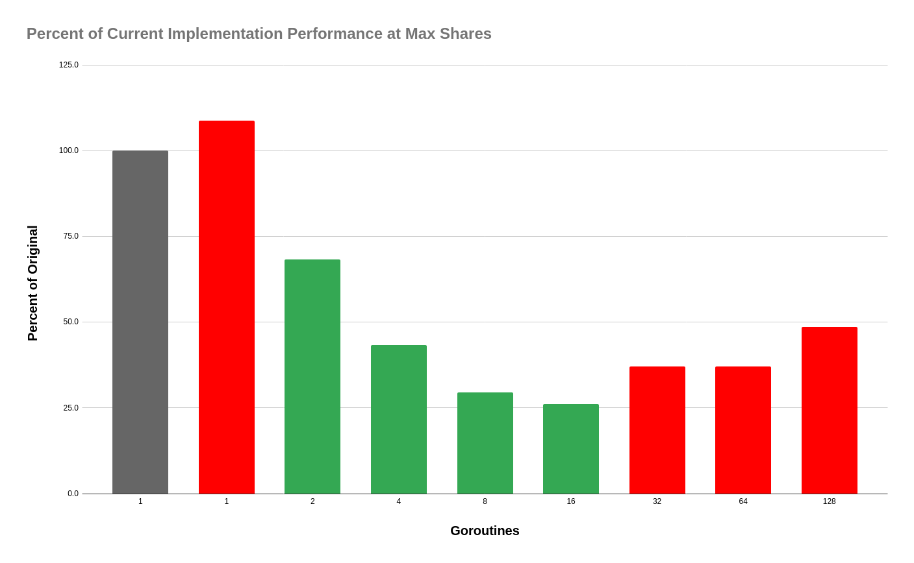
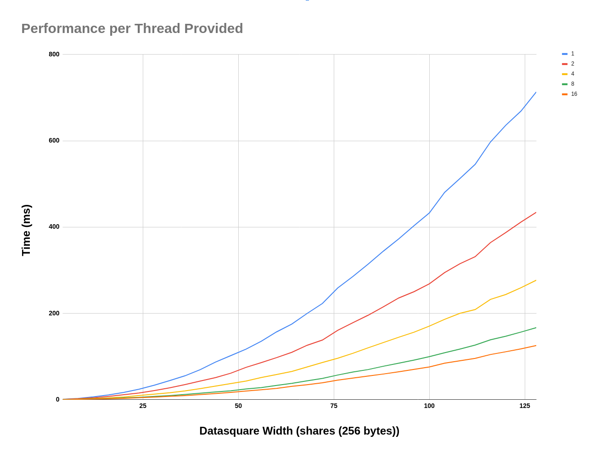
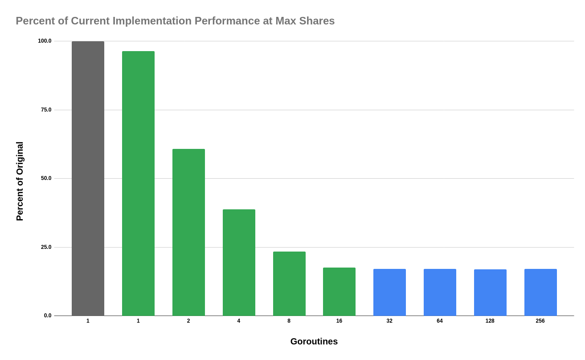
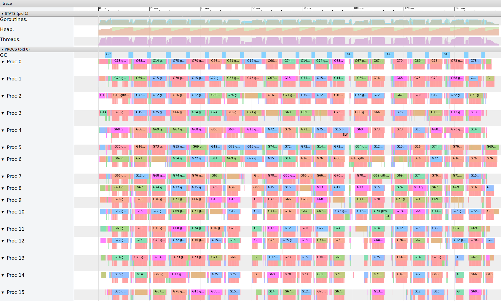

# Investigating Multithreaded Implementation of rstm2d and Hashing of the Data Availability Header

## Erasure Data Generation in rsmt2d

One point of easy paralleziation is to simply schedule some number of goroutines to generate erasure data for each column and row of the original data square. This effectively uses the same code as the original method `erasureExtentSquare` of the type `ExtendedDataSquare`

```Golang
// Extend original square horizontally and vertically
//  ------- -------
// |       |       |
// |   O → |   E   |
// |   ↓   |       |
//  ------- -------
// |       |
// |   E   |
// |       |
//  -------
// feed the first set of jobs for data square extension
phaseOneJobs := make(chan uint, eds.originalDataWidth)
go func() {
    defer close(phaseOneJobs)
    for i := uint(0); i < eds.originalDataWidth; i++ {
        phaseOneJobs <- i
    }
}()

// define the worker function
phaseOneWork := func(wg *sync.WaitGroup, jobs <-chan uint, errs chan<- error) {
    defer wg.Done()
    codec := NewRSGF8Codec()
    for i := range jobs {
        // encode data vertically
        err := eds.fillDown(i, codec)
        if err != nil {
            errs <- err
            return
        }
        // encode data horizontally
        err = eds.fillRight(i, codec)
        if err != nil {
            errs <- err
            return
        }
        errs <- nil
    }
}
```
and only slightly shortended for phase 2
```Golang
// Extend extended square horizontally
//  ------- -------
// |       |       |
// |   O   |   E   |
// |       |       |
//  ------- -------
// |       |       |
// |   E → |   E   |
// |       |       |
//  ------- -------
phaseTwoJobs := make(chan uint, eds.originalDataWidth)
go func() {
    defer close(phaseTwoJobs)
    for i := eds.originalDataWidth; i < eds.width; i++ {
        phaseTwoJobs <- i
    }
}()

phaseTwoWork := func(wg *sync.WaitGroup, jobs <-chan uint, errs chan<- error) {
    defer wg.Done()
    codec := NewRSGF8Codec()
    for job := range jobs {
        // encode data vertically
        err := eds.fillRight(job, codec)
        if err != nil {
            errs <- err
            return
        }
        errs <- nil
    }
}
```
Compared with the original method, this implementation also requires a mutex and a linear increase in allocations of `[]byte` from each row and column erasured.

Here are some benchmarks for my quick and dirty multithreaded implementation of erasure data in rsmt2d

 
The performance is increased roughly 4 fold on a 8 core, 16 thread cpu with GOMAXPROCS set to 16.

There is observable overhead introduced with the multithreaded implementation. At the maximum data square width, 128, there is about an 8% penalty when only a single thread is provided. As one might expect for a non io bound parallized workload, allowing more gouritines than there are virtual cpus results in non-optimized performance.


The trace is... nasty. There seems to be quite of lot of room for improvement, but I'm not sure how much due to the [3rd quadrant](https://github.com/lazyledger/lazyledger-specs/blob/master/specs/figures/rs2d_quadrants.svg) needing to be computed after the 2nd.

spreadsheet [here](https://docs.google.com/spreadsheets/d/1oLfHhEMRSsz99A26wBLddiLgaZiJN0P9c4y1hoHj2IE/edit?usp=sharing)

## Data Availability Header NMT Generation
As mentioned in the github issue, parallelizing the nmt generation is another easy way to decrease the time needed to create the data availabilty header hash. We can basically copy and paste the current implementation into a similar worker/job feeding structure as the previous section.
```Golang
work := func(wg *sync.WaitGroup, dah *DataAvailabilityHeader, jobs <-chan uint) {
    defer wg.Done()
    for outerIdx := range jobs {
        rowTree := nmt.New(newBaseHashFunc(), nmt.NamespaceIDSize(NamespaceSize))
        colTree := nmt.New(newBaseHashFunc(), nmt.NamespaceIDSize(NamespaceSize))
        for innerIdx := uint(0); innerIdx < squareWidth; innerIdx++ {
            if outerIdx < originalDataWidth && innerIdx < originalDataWidth {
                mustPush(rowTree, namespacedShares[outerIdx*originalDataWidth+innerIdx])
                mustPush(colTree, namespacedShares[innerIdx*originalDataWidth+outerIdx])
            } else {
                rowData := extendedDataSquare.Row(outerIdx)
                colData := extendedDataSquare.Column(outerIdx)

                parityCellFromRow := rowData[innerIdx]
                parityCellFromCol := colData[innerIdx]
                // FIXME(ismail): do not hardcode usage of PrefixedData8 here:
                mustPush(rowTree, namespace.PrefixedData8(
                    append(ParitySharesNamespaceID, parityCellFromRow...),
                ))
                mustPush(colTree, namespace.PrefixedData8(
                    append(ParitySharesNamespaceID, parityCellFromCol...),
                ))
            }
        }
    // create the root before locking the mutex
    rowRoot := rowTree.Root()
    colRoot := colTree.Root()
    // assign the roots in order
    dah.mtx.Lock()
    dah.RowsRoots[outerIdx] = rowRoot
    dah.ColumnRoots[outerIdx] = colRoot
    dah.mtx.Unlock()
    }
}
```
Each nmt can be generated independently and there are only a few minor extra allocations needed to safely add goroutines, so we should expect there to be less overhead for the multithreaded implementation. We should also expect to have a greater increase in performance per thread added.

Performance was increase a little less than 6x by adding 16 threads.

Adding more goroutines doesn't seem to introduce meaningful overhead.

The Trace looks significantly more uniform than for the erasure data generation, which explains the 6x increase in performance. The next steps should be looking into what can be done to get the expected ~8x performance improvement for such a parallelizable workload (It can be achieved if you turn off garbage collection, I tried just for fun.)

## Combining the Two Approaches
I also ran benchmarks for combining the two approaches. They're about what you would expect if you added the times for each previous two benchmarks (see `combined_performance.png`).

## Conclusions
As mentioned in the issue, there are opportunities to parallelize data availability header generation. These rather unoptimized implementations show that there are options for easy performance gains should they be required.


