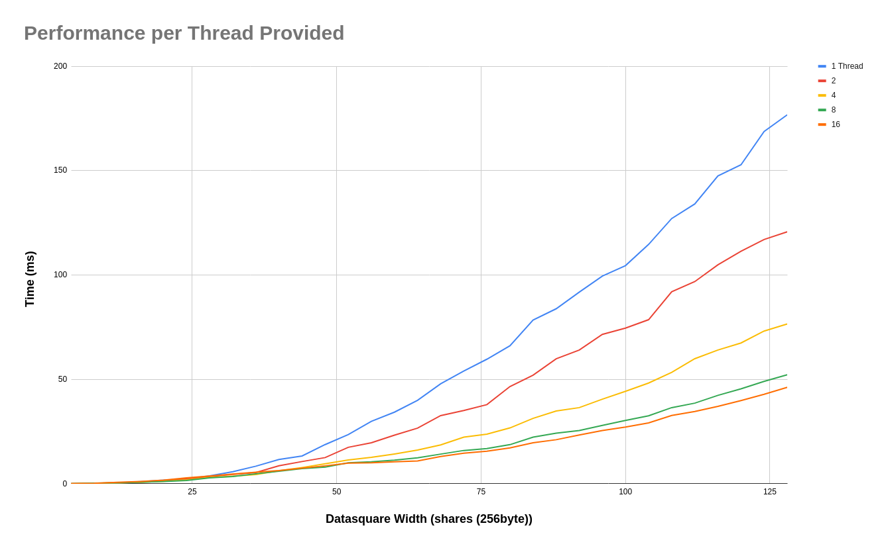

# Investigating Multithreaded Implementation of rstm2d and Hashing of the Data Availability Header

## Erasure Data Generation in rsmt2d

One point of easy paralleziation is to simple schedule some number of goroutines to generate erasure data for each column and row of the original data square. This effectively uses the same code as the original method `erasureExtentSquare` of the type `ExtendedDataSquare`

```Golang
// Extend original square horizontally and vertically
//  ------- -------
// |       |       |
// |   O → |   E   |
// |   ↓   |       |
//  ------- -------
// |       |
// |   E   |
// |       |
//  -------
// feed the first set of jobs for datasquare extension
phaseOneJobs := make(chan uint, eds.originalDataWidth)
go func() {
    defer close(phaseOneJobs)
    for i := uint(0); i < eds.originalDataWidth; i++ {
        phaseOneJobs <- i
    }
}()

// define the worker function
phaseOneWork := func(wg *sync.WaitGroup, jobs <-chan uint, errs chan<- error) {
    defer wg.Done()
    codec := NewRSGF8Codec()
    for i := range jobs {
        // encode data vertically
        err := eds.fillDown(i, codec)
        if err != nil {
            errs <- err
            return
        }
        // encode data horizontally
        err = eds.fillRight(i, codec)
        if err != nil {
            errs <- err
            return
        }
        errs <- nil
    }
}
```
and only slightly shortended for phase 2
```Golang
// Extend extended square horizontally
//  ------- -------
// |       |       |
// |   O   |   E   |
// |       |       |
//  ------- -------
// |       |       |
// |   E → |   E   |
// |       |       |
//  ------- -------
phaseTwoJobs := make(chan uint, eds.originalDataWidth)
go func() {
    defer close(phaseTwoJobs)
    for i := eds.originalDataWidth; i < eds.width; i++ {
        phaseTwoJobs <- i
    }
}()

phaseTwoWork := func(wg *sync.WaitGroup, jobs <-chan uint, errs chan<- error) {
    defer wg.Done()
    codec := NewRSGF8Codec()
    for job := range jobs {
        // encode data vertically
        err := eds.fillRight(job, codec)
        if err != nil {
            errs <- err
            return
        }
        errs <- nil
    }
}
```
Compared with the original method, this implementation also requires a mutex and a linear increase in allocations of `[]byte` from each row and column erasured.

Here are some benchmarks for my quick and dirty multithreaded implementation of erasure data in rsmt2d

 
The performance is increased roughly 4 fold on an 8 core cpu. 

The overhead was determined by comparing the current implementation with the multithreaded version limited to a single thread. While the overhead is within the margin of error time wise, I expect other measurements of overhead to be well above the current implementation due to the extra allocations required.


The trace is... nasty. There seems to be quite of lot of room for improvement, but I'm not sure how much due to the [3rd quadrant](https://github.com/lazyledger/lazyledger-specs/blob/master/specs/figures/rs2d_quadrants.svg) needing to be computed after the 2nd.

spreadsheet [here](https://docs.google.com/spreadsheets/d/1oLfHhEMRSsz99A26wBLddiLgaZiJN0P9c4y1hoHj2IE/edit?usp=sharing)

## Data Availability Header NMT Generation
As mentioned in the github issue, parallelizing the nmt generation is also an easy way to decrease the time needed to create the data availabilty header hash. We can basically copy and paste the current implementation into a similar worker/job feeding structure as shown in the previous section.
```Golang
work := func(wg *sync.WaitGroup, dah *DataAvailabilityHeader, jobs <-chan uint) {
    defer wg.Done()
    for outerIdx := range jobs {
        rowTree := nmt.New(newBaseHashFunc(), nmt.NamespaceIDSize(NamespaceSize))
        colTree := nmt.New(newBaseHashFunc(), nmt.NamespaceIDSize(NamespaceSize))
        for innerIdx := uint(0); innerIdx < squareWidth; innerIdx++ {
            if outerIdx < originalDataWidth && innerIdx < originalDataWidth {
                mustPush(rowTree, namespacedShares[outerIdx*originalDataWidth+innerIdx])
                mustPush(colTree, namespacedShares[innerIdx*originalDataWidth+outerIdx])
            } else {
                rowData := extendedDataSquare.Row(outerIdx)
                colData := extendedDataSquare.Column(outerIdx)

                parityCellFromRow := rowData[innerIdx]
                parityCellFromCol := colData[innerIdx]
                // FIXME(ismail): do not hardcode usage of PrefixedData8 here:
                mustPush(rowTree, namespace.PrefixedData8(
                    append(ParitySharesNamespaceID, parityCellFromRow...),
                ))
                mustPush(colTree, namespace.PrefixedData8(
                    append(ParitySharesNamespaceID, parityCellFromCol...),
                ))
            }
        }
    // create the root before locking the mutex
    rowRoot := rowTree.Root()
    colRoot := colTree.Root()
    // assign the roots in order
    dah.mtx.Lock()
    dah.RowsRoots[outerIdx] = rowRoot
    dah.ColumnRoots[outerIdx] = colRoot
    dah.mtx.Unlock()
    }
}
```

